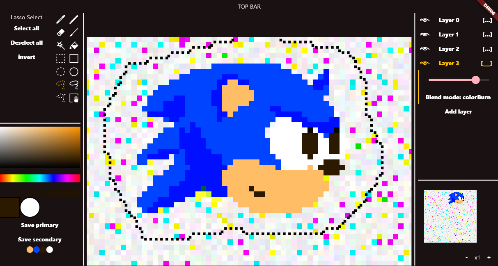

# pixel32_t

pixel32_t is a lightweight, cross-platform pixel art graphics editor built entirely with Dart and Flutter. It's meant to be fast and reliable on any platform, but that's still a work in progress.



## Features
- **Graphics tools** - pencil, brush, eraser, color picker, fill, shape, polygon
- **Selection tools** - magic wand, lasso, shape selection, polygon selection
- **Color panel** - primary and secondary colors with a color palett
- **Layers** - layers support with opacity and multiple blend modes


## Todo
- Canvas resizing, saving, loading
- Image buffer backups and operations history
- Complete UI library and interface rework (including mobile)
- Overall stability and preformence fixes across the whole codebase 


## Running the project
```
git clone https://github.com/miloszratajczyk/pixel32_t
cd pixel32_t

flutter pub get
flutter run
```

## License
This project is licensed under the MIT License. See [LICENSE](LICENSE.txt) for details.